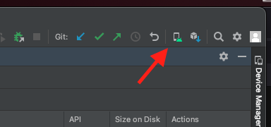
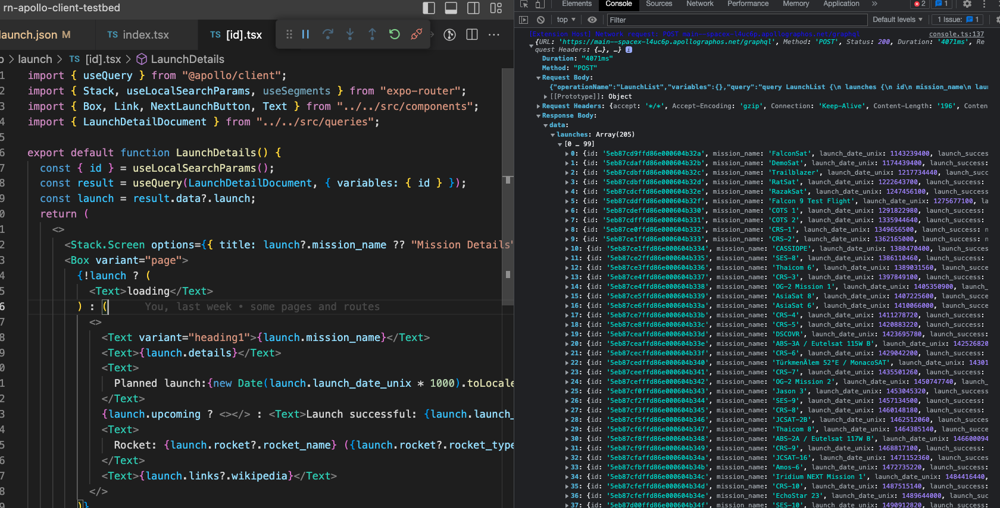

# React Native Example Project

The goal of this repository is to act as a starting point for reproductions, benchmarking and debugging.

## Preparations

* clone https://github.com/apollographql/rn-apollo-client-testbed
* `npm install`

### Quick Start (Android and iOS)

If running a development-only build is satisfactory, you can start the app with `npm run dev`.

If your reproduction requires performance benchmarking or would otherwise benefit from running in an emulator/simualtor against a production build of the demo application, please see the Getting Started sections below.

### Getting Started (Android)

* If no android phone is available, download Android Studio, create a project, and set up the emulator (button in the top toolbar pretty much to the right)
  
* Download the latest “Android Internal Distribution build” from the [Releases](https://github.com/apollographql/rn-apollo-client-testbed/releases)
* Install & start the app
* `npm run start` (will run `expo start --dev-client --tunnel`)
* Scan the QR code
* The app starts. You can now locally modify JavaScript sources. Unless new native dependencies are added, you do not need to rebuild the app.

### Getting Started (iOS)

* Install XCode and run the “Simulator” app
* Download the latest “iOS Simulator build” from the [Releases](https://github.com/apollographql/rn-apollo-client-testbed/releases)
* unzip it and drag the unpacked “rnapolloclienttestbed” file onto the simulator
* Start the app
* `npm run start` (will run `expo start --dev-client --tunnel`)
* connect to http://localhost:8081
* The app starts. You can now locally modify JavaScript sources. Unless new native dependencies are added, you do not need to rebuild the app.


## Profiling

### Recording a Profile (Android only at this point)

Watch the video: https://share.descript.com/view/8F2qEweqJoM 

* Start the App
* Reload the App at least twice (press R in the expo dev server console). 
    If you skip this step, you will record the wrong process and only see the Dev Menu stacks.
* In the expo dev server console window, press m to open the menu
* Scroll to the bottom, select “Open React Native Dev Menu”
* Select “Enable Sampling Profiler”
* Do the actions you want to record (warning: this might start hanging after a while!
* Press m again, go to the React Native Dev Menu again, select “Enable Sampling Profiler” again
* You will see a Toast “saved results from profiler”
* Open a second terminal window
* Run yarn react-native profile-hermes . 
* A profile has been downloaded - check the next section on fixing up source map references

### Fixing up a Profile

A recorded profile will still contain a lot of source map references and anonymous function names.
That can be fixed by running
```sh
npx @phryneas/process-profile-sourcemaps ./sampling-profiler-traceXXXXXXXXXXXXXXXXXXX-converted.json ./sampling-profiler-traceXXXXXXXXXXXXXXXXXXX-converted-fixed.json
```

## Debugging

### Using the Chrome debugger

* Toggle the Dev Menu from the Expo Terminal by pressing “m”
* Select “Open JS Debugger”
* A Chrome window with DevTools for the running app should open

### Using Flipper

You can use Flipper to look at both system and application logs, as well as debugging (like above). Flipper also includes the React Devtools and a bunch of other plugins.
⚠️ if you started Flipper once, your application might crash whenever you start it without Flipper running. You will need to uninstall & reinstall the app to get it working without Flipper afterward.

#### Flipper: React Native Apollo Devtools

This repo is set up for the [Flipper React Native Apollo Devtools](https://github.com/razorpay/react-native-apollo-devtools), so if you are using Flipper, you can install and enable the `react-native-apollo-devtools` plugin.

### Inspecting Network Traffic

You can use the VSCode “React Native” extension to debug the app & inspect network traffic.
Start the application as usual. Then run the “Attach to Hermes application - Experimental” debugger configuration.
After that, press Cmd+Shift+P and run the “React native: run Network Inspector“ command, which will open devtools to the side where you will see network requests as console logs.
