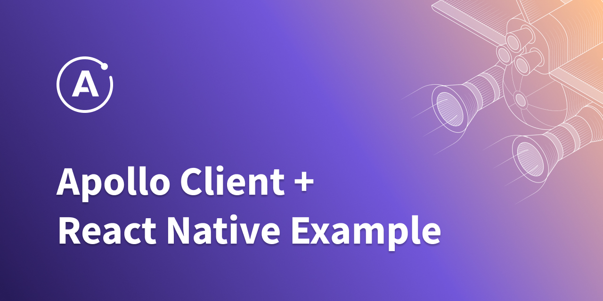

  
  
A starting point for reproductions, benchmarking and debugging applications built with <a href="https://reactnative.dev/">React Native</a> and <a href="https://github.com/apollographql/apollo-client">Apollo Client</a>.

| ☑️ Apollo Client User Survey                                                                                                                                                                                                                                                                                                                                                             |
| :--------------------------------------------------------------------------------------------------------------------------------------------------------------------------------------------------------------------------------------------------------------------------------------------------------------------------------------------------------------------------------------- |
| What do you like best about Apollo Client? What needs to be improved? Please tell us by taking a [one-minute survey](https://docs.google.com/forms/d/e/1FAIpQLSczNDXfJne3ZUOXjk9Ursm9JYvhTh1_nFTDfdq3XBAFWCzplQ/viewform?usp=pp_url&entry.1170701325=Apollo+Client&entry.204965213=Readme). Your responses will help us understand Apollo Client usage and allow us to serve you better. |

## Preparations

- clone https://github.com/apollographql/rn-apollo-client-testbed
- `npm install`

### Quick Start (Android and iOS)

Install Expo Go ([Download Expo Go here](https://expo.dev/go)) on your emulator or phone.
Then run `npm run android` or `npm run ios` to start the app in Expo Go.

## Debugging

### Using the Chrome debugger

- Toggle the JS Debugger by pressing "j" in the Expo command line
- A Chrome window with DevTools for the running app should open

### Using the Apollo GraphQL VSCode extension to inspect Apollo Client cache

Please see [Apollo Client Devtools in VS Code](https://www.apollographql.com/docs/react/development-testing/developer-tooling#apollo-client-devtools-in-vs-code) for more details.
